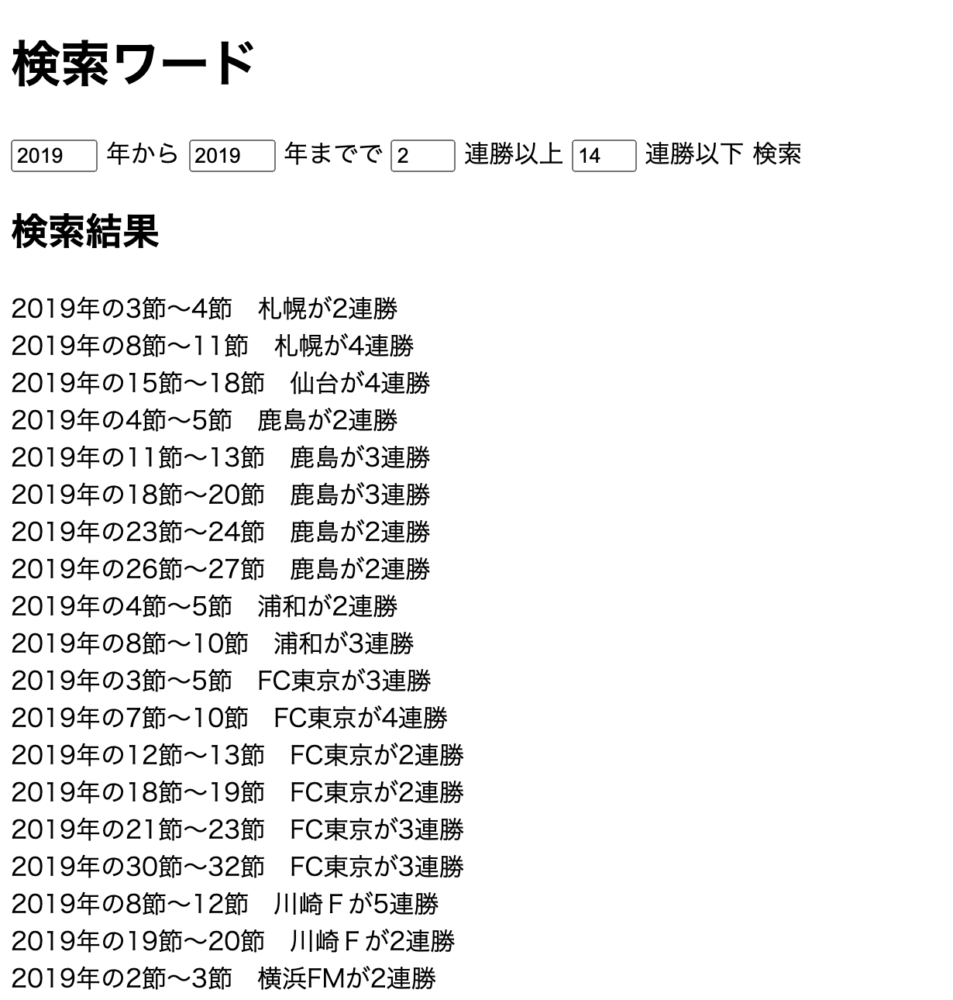

# J検索くんフロント
- サッカーJリーグのデータをスクレイピングしたWebAPIからデータを受け取り検索を行う。
- J1の連勝記録を調べることができる。
- [こちらから検索サイトに飛べます](http://j-search.s3-website-ap-northeast-1.amazonaws.com/)
- フロントの検索画面

<!-- 画像がずれてるので配置とサイズ修正 -->
# アピールポイント
- webAPI利用して検索する。
<!-- # 全体の構成・使用技術・ライブラリなど -->
# 使用技術
- Javascript

<!-- # 使い方 -->

# 注意・補足
現在2017〜2019のデータのみ検索できます。
# 作成者
増井　悠太